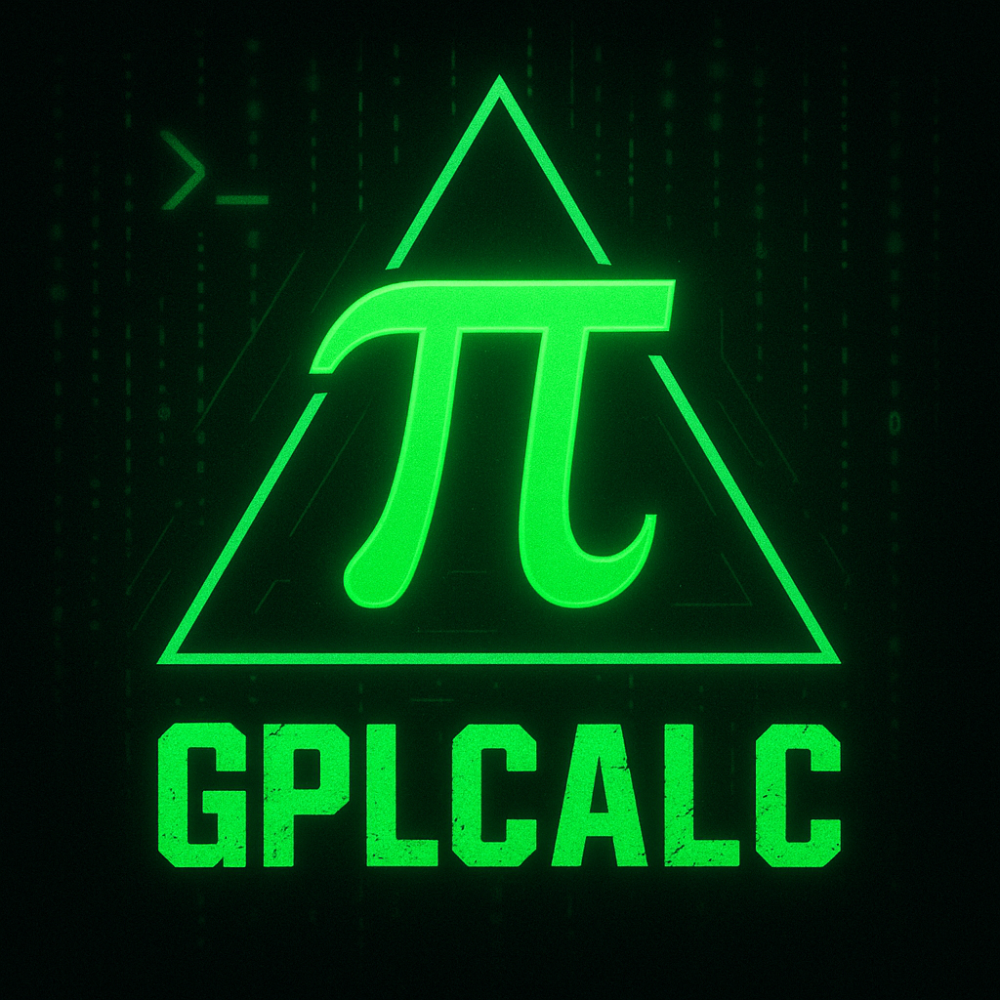

# gplcalc
Uçbirim tabanlı, özgür yazılım ve hafif bir hesap makinesi.   
Yapabileceği işlemler:

- 4 Temel işlem (+, −, ×, ÷)
- Karekök hesaplama
- Üssü alma
- Hipotenüs hesaplama

> **Note:** If you are looking for English version, (click here)[https://github.com/npc-gnu/gplcalc] .

## İndirme

### 1. Depoyu indirin/klonlayın
`git clone https://github.com/npc-gnu/gplcalc.git && cd gplcalc`
### 2. Yükleyiciyi Çalıştırın:
`chmod +x install && ./install`

## Kalan Ayrıntılar:
 Bu yazılım iostream ve cmath kütüphanelerini içermektedir.
 Bu yazılım tamamen C++ dilinde; Kitty Terminali, bolca vim, hafif kate, Arch GNU+Linux ve g++ ile yazılmıştır.

## Lisans:

Bu yazılım ve onun her bir parçası GNU is Not UNIX General Public Lisence 3. sürüm ile lisanslanmıştır. (GPLv3)
